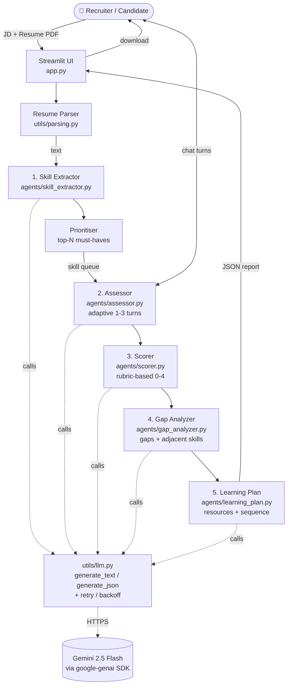

# Architecture

## Overview

The system is a single Streamlit app orchestrating five specialised LLM agents over a shared session state. Each agent has one well-defined job, a single system prompt, and a typed JSON output schema enforced by Gemini's structured-output mode — so the boundaries between components are crisp and inspectable.

## Diagram



## Components

### 1. Skill Extractor
Single LLM call. Parses JD and resume into structured JSON with canonical lowercase skill names so they merge cleanly. After extraction, `merge_skills` deterministically joins the two lists; `prioritise_for_assessment` picks the top-N skills to interview using:

```
score(skill) = importance_weight × target_level × gap_signal
  importance_weight = 1.0 if must_have else 0.4
  gap_signal        = 1.0 if (target − claimed) ≤ 1 else 0.6
```

The `gap_signal` term is intentional: skills where the resume implies a level far below the target are obvious gaps; the interview adds little signal there. Better to spend interview budget on skills near the proficiency boundary.

### 2. Assessor
Adaptive conversation per skill. The system prompt enforces: one question at a time (≤3 sentences), difficulty scaled to previous answers, no out-loud grading, hard cap at 3 turns. The model emits `<<DONE>>` when it judges signal sufficient.

### 3. Scorer
Single low-temperature (0.1) JSON call per skill. Inputs: skill name + transcript. Outputs four sub-dimension scores (conceptual, applied, vocabulary, edge_cases) plus an overall 0–4 level and a confidence score. Low temperature gives stable grading across runs.

### 4. Gap Analyzer
Receives JD skills, resume skills, and assessor outputs. Returns:
- `primary_gaps` — required skills where assessed < target, ranked by priority.
- `adjacent_skills` — up to 5 high-leverage skills *not* in the JD but within reach. Each has `leverage_from`, `weeks_to_basic`, and `why_relevant`.

This is the differentiator vs a generic gap report. A naive tool says "you're missing X" — this one says "you already know A and B, so C is ~3 weeks away, and C is what teams in this role actually use."

### 5. Learning Plan
Final synthesis. For each item: 2–4 resources (course/docs/book/project mix), weekly hours, weeks to target, and a capstone project. Then a 12-week phased sequence interleaving 1–2 tracks in parallel. The system prompt forbids inventing URLs or course names.

## State management

Streamlit's `st.session_state` carries everything between reruns. Four high-level steps: `input → extracted → assessing → done`.

## LLM wrapper

Two functions — `generate_text` and `generate_json` — both retry on transient errors with exponential backoff. Provider-specific code lives only here; the agents never import `google.genai` directly.

## Why this shape

- **Five small agents instead of one mega-prompt** — each is independently testable, each system prompt is short enough to tune precisely, and failure surfaces are localised. If scoring drifts, you fix the scorer prompt without disturbing extraction.
- **Structured output everywhere** — `response_json_schema` on Gemini means we never parse free-form text. Schemas are colocated with the prompts they're used with.
- **Adaptive interviews instead of fixed quizzes** — better signal per turn, more natural for the candidate, scales to any skill without authoring a question bank.
- **Adjacency analysis as a separate step** — keeps the gap report honest (what's missing) and the learning plan ambitious (what's reachable).